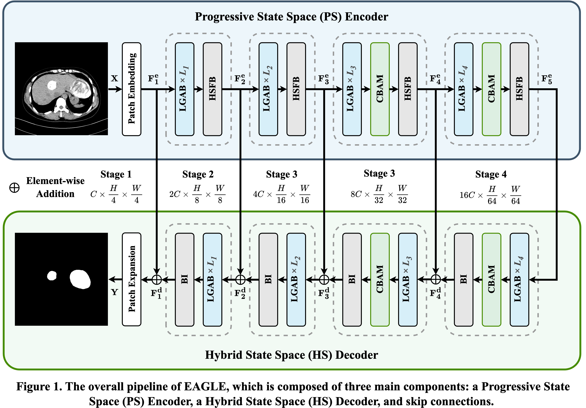
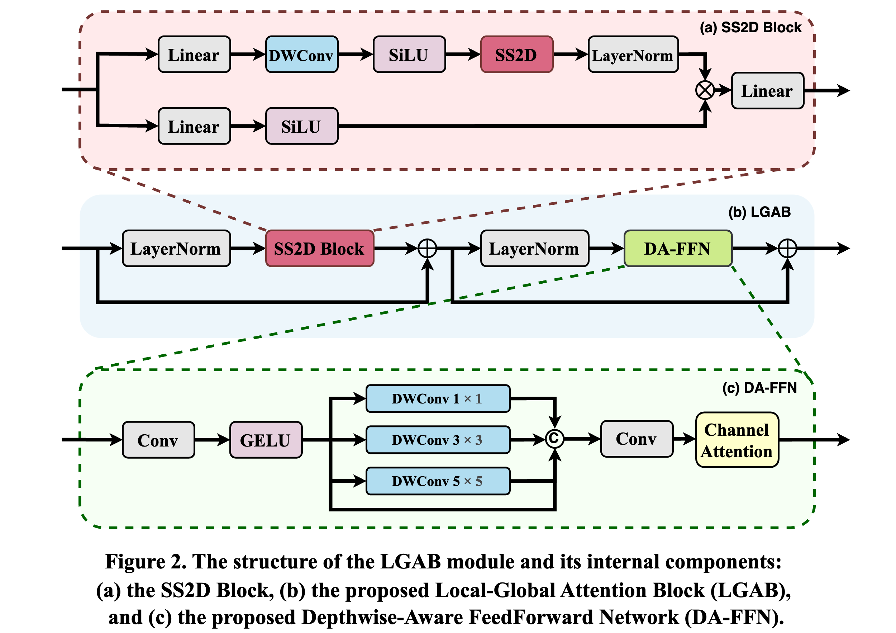
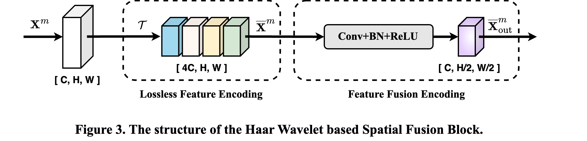

  

  <strong>Jiayan Chen1, <strong>Kai Li2, <strong>Yulu Zhao1, Zhan Wang1,*</strong> 
    <strong>1Qinghai University, Xining, China</strong> 
    <strong>2Tsinghua University, Beijing, China</strong> 
  <a href="https://chenjiayan-qhu.github.io/ELGMamba/">Paper</a> | <a href="https://chenjiayan-qhu.github.io/ELGMamba/">Demo</a>

  

# ELGMamba: An Efficient Mamba-Based UNet for Local and Global Feature Modeling in Hepatic Echinococcosis Lesion Segmentation
Hepatic echinococcosis (HE) is a parasitic disease prevalent in remote pastoral regions with limited medical infrastructure. While CNN- and Transformer-based models have advanced medical image segmentation, they suffer from limitations: CNNs lack global context due to local receptive fields, and Transformers, though effective at capturing long-range dependencies, are computationally demanding. Recently, state space models (SSMs), such as the Mamba architecture, have emerged as efficient alternatives with linear complexity and global receptive fields. We propose ELGMamba, a novel U-shaped segmentation network that integrates CNNs, Transformers, and SSMs. The model incorporates a Local-Global Attention Block (LGAB) to fuse local and global features, and a HaarWavelet-based Spatial Fusion Block (HSFB) for lossless downsampling via Haar wavelets. ELGMamba employs a Progressive State Space (PS) Encoder and a Hybrid State Space (HS) Decoder for effective multi-scale representation and lesion localization. To support research on HE, we curated a CT dataset of 260 confirmed cases. Experiments show ELGMamba achieves a Dice Similarity Coefficient (DSC) of 89.76%, surpassing MSVM-UNet by 1.61%.

  

  

  

The code will be uploaded shortly. Please stay tuned as we finalize the preparation.
