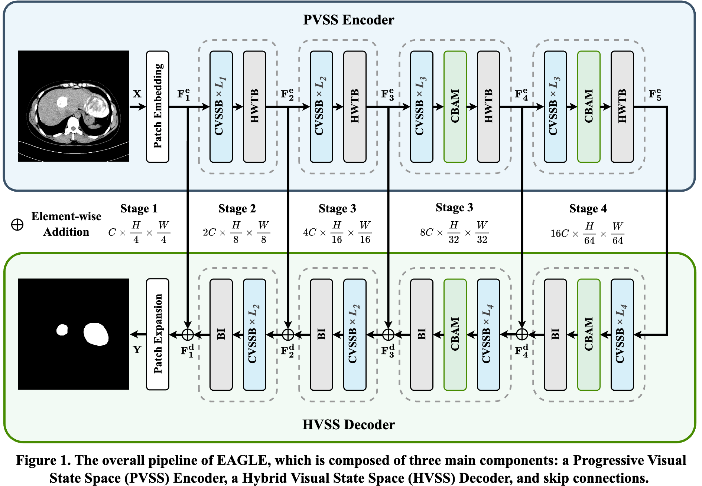
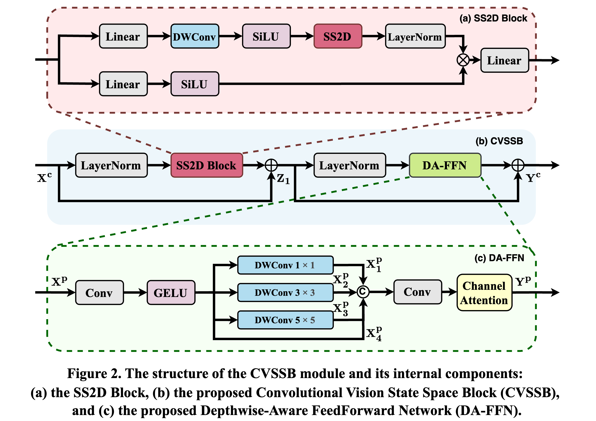
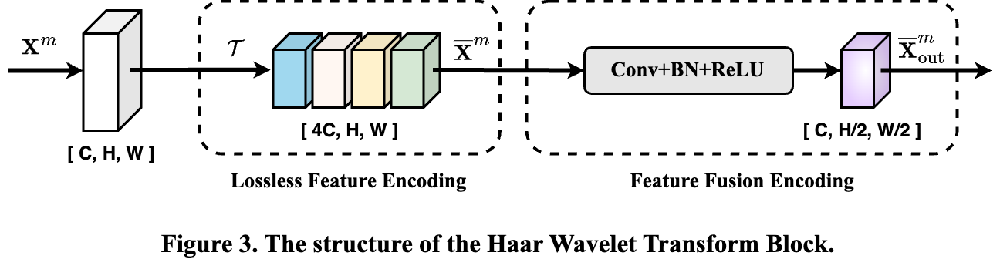

  

  <strong>Jiayan Chen1, <strong>Kai Li2, <strong>Yulu Zhao1, <strong>Zhanjin Wang1, Zhan Wang3</strong> 
    <strong>1Qinghai University, Xining, China</strong> 
    <strong>2Tsinghua University, Beijing, China</strong> 
    <strong>3Affiliated Hospital of Qinghai University, Xining, China</strong> 
  <a href="https://chenjiayan-qhu.github.io/EAGLE/">Paper</a> | <a href="https://chenjiayan-qhu.github.io/EAGLE/">Demo</a>

# EAGLE: An Efficient Global Attention Lesion Segmentation Model for Hepatic Echinococcosis
Hepatic echinococcosis (HE) is a widespread parasitic disease in underdeveloped pastoral areas with limited medical resources. While CNN-based and Transformer-based models have been widely applied to medical image segmentation, CNNs lack global context modeling due to local receptive fields, and Transformers, though capable of capturing long-range dependencies, are computationally expensive. Recently, state space models (SSMs), such as Mamba, have gained attention for their ability to model long sequences with linear complexity. In this paper, we propose EAGLE, a U-shaped network that integrates CNNs, Transformers, and SSMs. We introduce the Convolutional Vision State Space Block (CVSSB) to fuse local and global features and employ the Haar Wavelet Transformation Block (HWTB) for lossless downsampling. EAGLE leverages the synergy between the proposed Progressive Visual State Space (PVSS) Encoder and Hybrid Visual State Space (HVSS) Decoder to achieve efficient and accurate segmentation of HE lesions. Due to the lack of publicly available HE datasets, we collected CT slices from 260 patients at the Affiliated Hospital of Qinghai University. Experimental results show that EAGLE achieves state-of-the-art performance with a Dice Similarity Coefficient (DSC) of 89.76%, surpassing MSVM-UNet by 1.61%.

  

  

  

The code will be uploaded shortly. Please stay tuned as we finalize the preparation.
