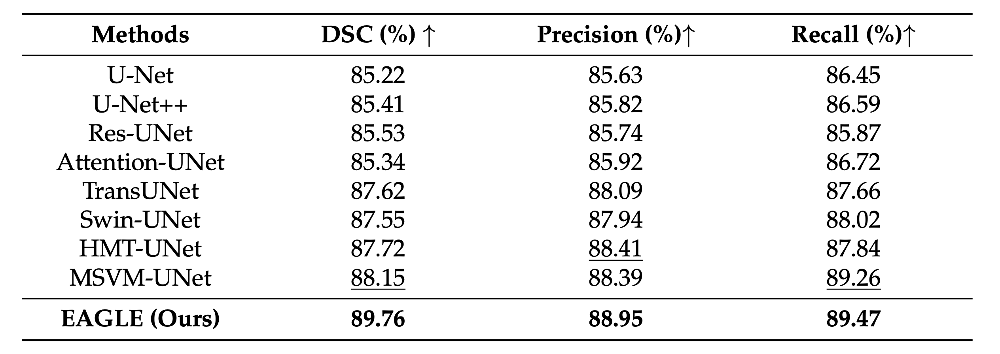

<p align="center">
  
</p>


<h1 align="center">
EAGLE: An Efficient Global Attention Lesion Segmentation Model for Hepatic Echinococcosis
</h1>


## 📜 Abstract

Hepatic echinococcosis (HE) is a widespread parasitic disease in underdeveloped pastoral areas with limited medical resources. While CNN-based and Transformer-based models have been widely applied to medical image segmentation, CNNs lack global context modeling due to local receptive fields, and Transformers, though capable of capturing long-range dependencies, are computationally expensive. Recently, state space models (SSMs), such as Mamba, have gained attention for their ability to model long sequences with linear complexity. In this paper, we propose EAGLE, a U-shaped network that integrates CNNs, Transformers, and SSMs. We introduce the Convolutional Vision State Space Block (CVSSB) to fuse local and global features and employ the Haar Wavelet Transformation Block (HWTB) for lossless downsampling. EAGLE leverages the synergy between the proposed Progressive Visual State Space (PVSS) Encoder and Hybrid Visual State Space (HVSS) Decoder to achieve efficient and accurate segmentation of HE lesions. Due to the lack of publicly available HE datasets, we collected CT slices from 260 patients at a local hospital. Experimental results show that EAGLE achieves state-of-the-art performance with a Dice Similarity Coefficient (DSC) of 89.76%, surpassing MSVM-UNet by 1.61%.

## 🦅 EAGLE
Overall pipeline of the model architecture of EAGLE and its modules.

<p align="center">
  
</p>

<p align="center">
  
</p>

<p align="center">
  
</p>

## Result
Performance comparison between EAGLE and other existing lesion segmentation models. **Bold** indicates the best performance, and _underline_ indicates the second-best performance.

<p align="center">
  
</p>

Ablation study on the impact of our proposed modules on model performance.

<p align="center">
  
</p>


The following demos illustrate a comparison between EAGLE and other existing segmentation models on our dataset. In the visualization, true positives (TP) are highlighted in green , false positives (FP) in blue, and false negatives (FN) in hotpink.

**Cystic Echinococcosis (CE) Lesion Segmentation Sample**

<p align="center">
  
</p>

**Alveolar Echinococcosis (AE) Lesion Segmentation Sample**

<p align="center">
  
</p>

## 📦 Installation

```bash
git clone ../EAGLE.git
cd EAGLE
conda env create -f eagle.yml
conda activate eagle
```

## 🚀 Quick Start

### 🧠 Dataset
Please organize your dataset according to the following directory structure:
```
data/
├── train/                 
│   ├── image/             # CT image
│   │   ├── 001.png
│   │   ├── 002.png
│   │   └── ...
│   └── mask/             # Mask
│       ├── 001.png
│       ├── 002.png
│       └── ...
├── val/                   
│   ├── image/
│   │   ├── 101.png
│   │   ├── 102.png
│   │   └── ...
│   └── mask/
│       ├── 101.png
│       ├── 102.png
│       └── ...
└── test/                  
    ├── image/
    │   ├── 201.png
    │   ├── 202.png
    │   └── ...
    └── mask/
        ├── 201.png
        ├── 202.png
        └── ...
```

### ⚙️ Model config
Please configure the model and training hyperparameters in 'local/eagle.yml'.

### ✨ Training
You can run the following command to train the EAGLE:
```
python train_baseline.py
```

## 📖 Citation

```bibtex

```


